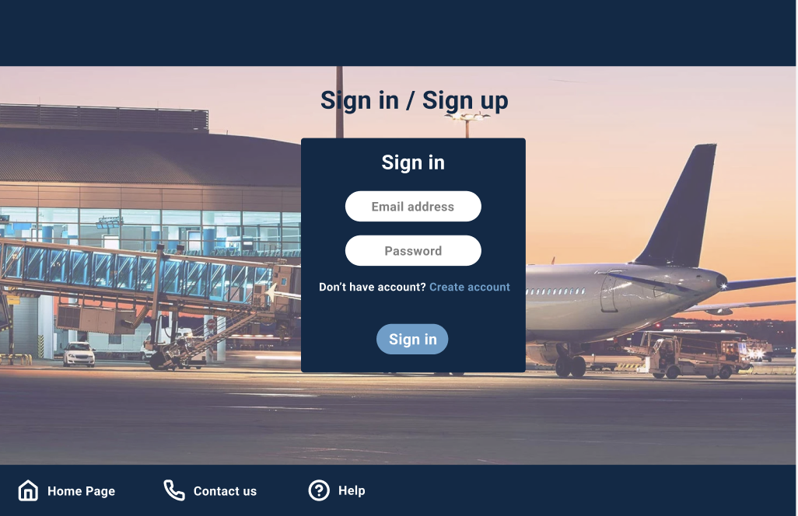
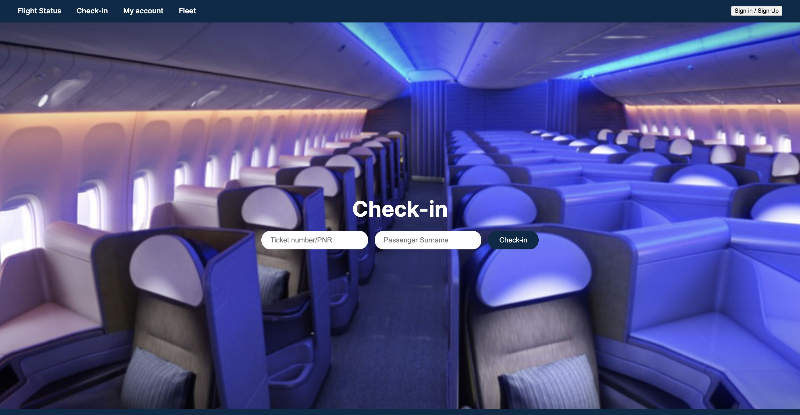
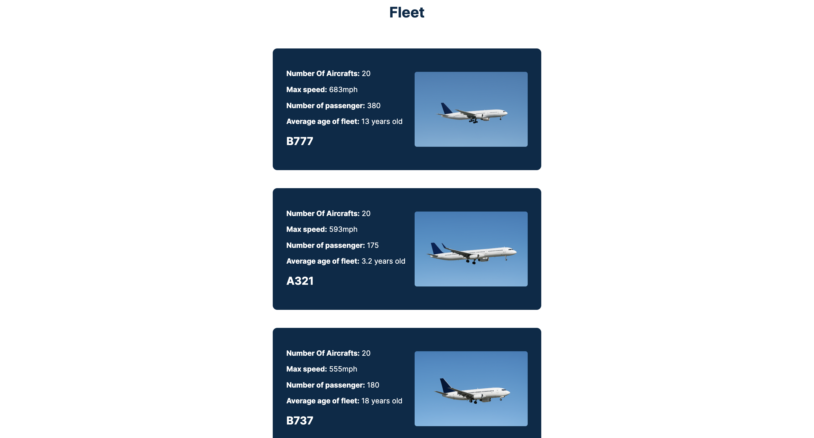

# ✈️Airline-Reservation-System✈️

### Overview
This Java project is built to help the customers book tickets online, check the availability of seats, get the details of the flight arrival, select the class they want to choose, and departures reserve seats for national or international flights.

### Abstract
This web-based Java project helps you in searching from pick-up location to destination, and filters out the flight details with timing, and available seats. It consolidates data from all airlines using globally distributed systems. After entering all the required details of the customer, it asks you to choose a flight with a preferred time slot, complete the payment, and book the ticket. It provides rates in real-time to customers as well as to travel agents. It also has two sections where you get to book a national and an international flight wherein you can book a domestic or international flight as per your choice.

